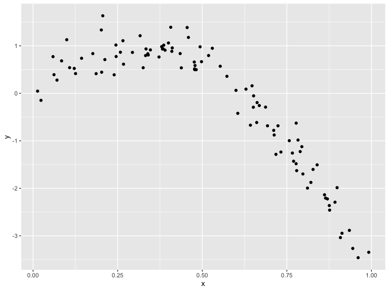
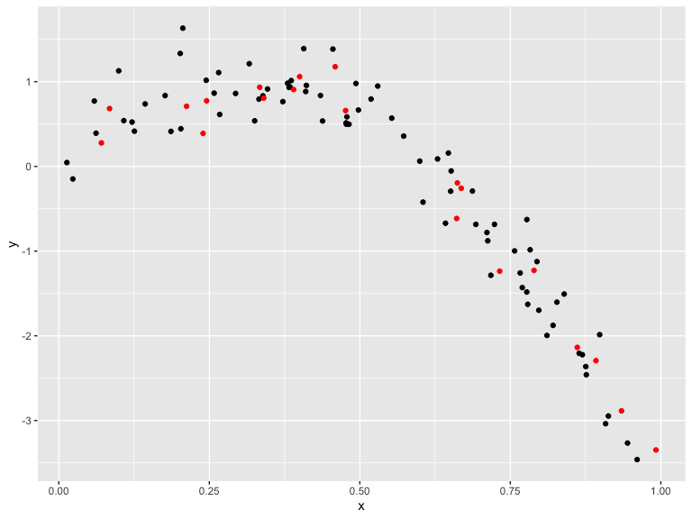
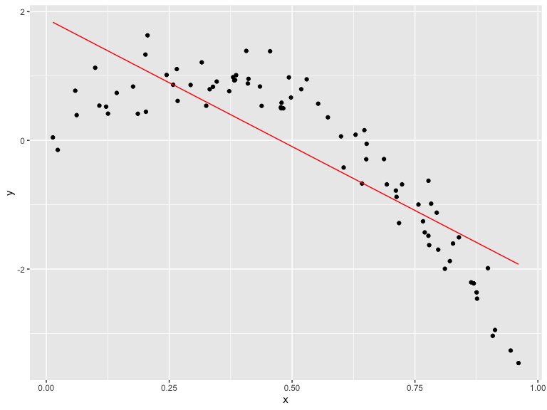
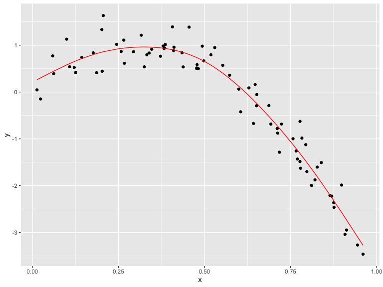
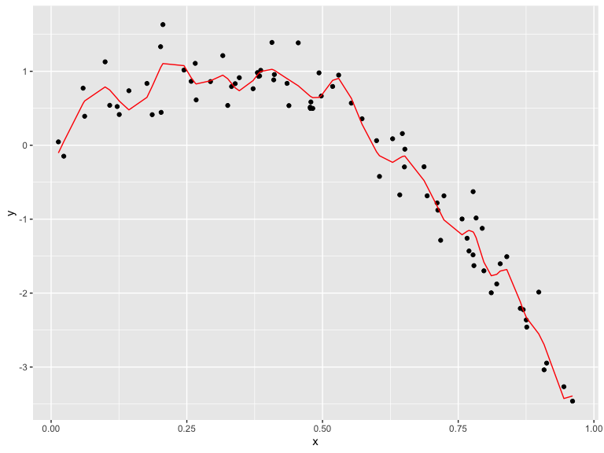

Cross Validation
================
Emma Sexton
2022-12-02

## Step One

Cross-validation “by hand” on simulated data

``` r
nonlin_df = 
  tibble(
    id = 1:100, # 100 rows
    x = runif(100, 0, 1), # uniform distribution
    y = 1 - 10 * (x - .3) ^ 2 + rnorm(100, 0, .3) # non-linear relationship between x and y
  )

nonlin_df %>% 
  ggplot(aes(x = x, y = y)) + 
  geom_point()
```



X is between 0 and 1 and there’s a non-linear relationship

Let’s get this by hand.

Take a training data set that’s 80% and then the testing dataframe that
will be the rest

``` r
train_df = sample_n(nonlin_df, 80)
# creating df with 80% of dataset
test_df = anti_join(nonlin_df, train_df, by = "id")
# give me everything that's not in my training dataset

train_df %>% 
  ggplot(aes(x = x, y = y)) +
  geom_point() +
  geom_point(data = test_df, color = "red")
```



Let’s try to fit three models… Nothing to do with TESTING dataset – this
all has to do with training data

Applying simple linear model, then smooth model, then wiggly (breaks the
model a little bit)

``` r
linear_mod = lm(y ~ x, data = train_df)
smooth_mod = mgcv::gam(y ~ s(x), data = train_df)
wiggly_mod = mgcv::gam(y ~ s(x, k = 30), sp = 10e-6, data = train_df)
```

Let’s see the results.

``` r
train_df %>% 
  add_predictions(linear_mod) %>% # gives column with predictions
  ggplot(aes(x = x, y = y)) +
  geom_point() +
  geom_line(aes(y = pred), color = "red")
```



``` r
# model isn't complex enough to fit the dataset

train_df %>% 
  add_predictions(smooth_mod) %>% # gives column with predictions
  ggplot(aes(x = x, y = y)) +
  geom_point() +
  geom_line(aes(y = pred), color = "red")
```



``` r
# this one has a reasonably good fit

train_df %>% 
  add_predictions(wiggly_mod) %>% # gives column with predictions
  ggplot(aes(x = x, y = y)) +
  geom_point() +
  geom_line(aes(y = pred), color = "red")
```



``` r
# this one has gone too much; it's too complex
```

How would you pick between the models? You use cross-validation!

Let’s make predictions and compute RMSEs. Add predictions to the
dataframe from this model

``` r
test_df %>% add_predictions(linear_mod)
```

    ## # A tibble: 20 × 4
    ##       id      x      y     pred
    ##    <int>  <dbl>  <dbl>    <dbl>
    ##  1     8 0.661  -0.615 -0.735  
    ##  2    18 0.992  -3.35  -2.05   
    ##  3    21 0.935  -2.89  -1.82   
    ##  4    22 0.212   0.710  1.05   
    ##  5    30 0.340   0.807  0.537  
    ##  6    36 0.668  -0.258 -0.766  
    ##  7    46 0.789  -1.23  -1.25   
    ##  8    49 0.732  -1.24  -1.02   
    ##  9    52 0.861  -2.14  -1.53   
    ## 10    55 0.0707  0.278  1.61   
    ## 11    59 0.662  -0.195 -0.740  
    ## 12    63 0.459   1.18   0.0659 
    ## 13    69 0.0842  0.683  1.55   
    ## 14    74 0.334   0.935  0.563  
    ## 15    75 0.476   0.659 -0.00274
    ## 16    76 0.892  -2.29  -1.65   
    ## 17    78 0.390   0.908  0.340  
    ## 18    83 0.400   1.06   0.300  
    ## 19    89 0.245   0.775  0.914  
    ## 20    91 0.240   0.389  0.937

These values have nothing to do with the dataset.

``` r
rmse(linear_mod, test_df)
```

    ## [1] 0.7052956

``` r
rmse(smooth_mod, test_df)
```

    ## [1] 0.2221774

``` r
rmse(wiggly_mod, test_df)
```

    ## [1] 0.289051

LOWER IS BETTER – think of RMSE as prediction error (lower is more
accurate)

Do this over and over again –\> the way we do that is having a dataframe
with training/testing split and then iterating

## Can we iterate…?

``` r
cv_df = 
  crossv_mc(nonlin_df, 100)
```

This created a big dataset containing a bunch of little datasets

``` r
cv_df %>% 
  pull(train) %>% 
  .[[1]]
```

    ## <resample [79 x 3]> 1, 2, 3, 4, 6, 7, 8, 9, 10, 11, ...

Get first entry of that list –\> what they’re trying to do is that you
don’t have to keep track of these dataframes, you just have to keep
track of the training/testing results

``` r
cv_df %>% 
  pull(train) %>% 
  .[[1]] %>% 
  as_tibble
```

    ## # A tibble: 79 × 3
    ##       id      x       y
    ##    <int>  <dbl>   <dbl>
    ##  1     1 0.266   1.11  
    ##  2     2 0.372   0.764 
    ##  3     3 0.573   0.358 
    ##  4     4 0.908  -3.04  
    ##  5     6 0.898  -1.99  
    ##  6     7 0.945  -3.27  
    ##  7     8 0.661  -0.615 
    ##  8     9 0.629   0.0878
    ##  9    10 0.0618  0.392 
    ## 10    11 0.206   1.63  
    ## # … with 69 more rows

What we need to be able to do is FIT THE MODELS WE CARE ABOUT to the
data Apply in each training dataset a linear model and then get a RMSE
out of that

``` r
cv_df <-
  crossv_mc(nonlin_df, 100) %>% 
  mutate(
    train = map(train, as_tibble),
    test = map(test, as_tibble)
  )
```

Goal is to fit linear model to the first training dataset and then the
next etc.

``` r
cv_df =
  crossv_mc(nonlin_df, 100) %>% 
  mutate(
    train = map(train, as_tibble),
    test = map(test, as_tibble),
    linear_fits = map(.x = train, ~lm(y ~ x, data = .x))
  )
```
